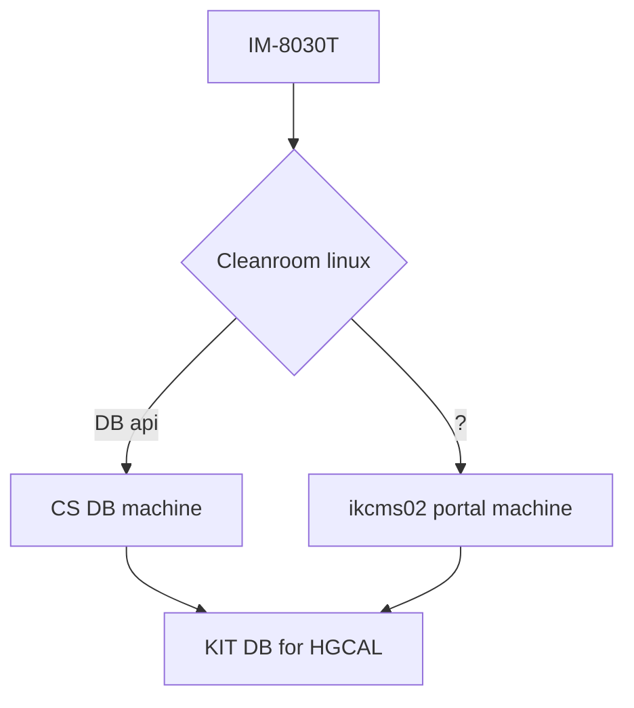

# Short summary for QC workflow
Author: Dwong, Jlawhorn  
Laste edited: Feb 10, 2025  
Initialized: Feb 10, 2025  
## Info about the machines

- **Keyence(win10):**  
Only connected to CN internal network  
    - ip: 192.168.13.89
    - username: IM-user  
    - password: IM-user
- **cleanroom gpu monster(alma linux):**  
Only connected to CN internal netwrok  
    - ip: 
    - username: readout
    - password: apv256
- **ikcms02:** 
POrtal machine connected to both CN and CS internal network
    - username: wong
    - username: jlawhorn

## Workflow

