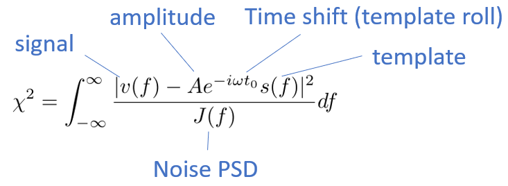

# OptimumFilter classes

Optimum Filter classes are inspired by [QETpy](https://github.com/spice-herald/QETpy) and SuperCDMS OptimumFilter classes.

One source of information about the Optimum Filter is the appendix E in
[Noah Kurinsky's thesis](https://www.slac.stanford.edu/exp/cdms/ScienceResults/Theses/kurinsky.pdf).

Helix OptimumFilter classes are vectorized over input traces, templates and noise PSDs, meaning that one object of the
OptimumFilter class can handle multiple channels with their own templates and noise PSDs simultaneously.

Refer to the doc-strings for complete documentation of the classes described below.

## OptimumFilter

This class performs a simple one template Optimum Filter fit, by minimizing the following chi-squared:



The class provides two fit functions: `fit` and `fit_with_no_shift`.

`fit_with_no_shift` does fit the template to the signal trace as it is, with template amplitude being the only free
parameter.

The `fit` function, on the other hand, has a second fit parameter - the number of samples the template is rolled around
its edges. The `allowed_shifts` argument specifies the range of allowed template roll in time samples. (We call it
"shifts" everywhere in the code and in the doc-strings).

## TwoTemplatesOptimumFilter

This class simultaneously fits two different templates to one trace, with the template shifts (or rather rolls)
independent of one another. This is useful for events with two different type of signals (e.g., ultraviolet and
quasiparticle signals in the case of DELight).

The fit algorithm is "greedy" - it tries all the possible template shift combinations and returns the one that produces
the smallest chi-squared value. With the templates of length L and unrestricted template shifts, there are L^2 possible
combinations of different template shifts. This quickly becomes computationally expensive. Therefore, it is highly
recommended to constrain the allowed template shifts (independent as well as relative) by using the `allowed_shifts` and
`allowed_deltas` properties.

`allowed_shifts` is a list of two tuples that define the allowed shifts of the two templates.

`allowed_deltas` is a tuple that describes the allowed shifts of the templates relative to one another.

For example, `allowed_shifts = [(-200, 200), (0, 200)]` means that the first template can shift by up to 200 samples to
the left and to the right, while the second template is only allowed to shift by up to 200 samples to the right. If the
first template shifts by 200 samples to the left, and the second one by 200 samples to the right, their relative shift 
is 400 samples. This can be restricted by providing `allowed_deltas` in addition to the `allowed_shifts`. For example,
`allowed_deltas = (0, 200)` would ensure that the two templates stay within the 200 time samples from each other. In
this example, if the first template is shifted by 200 samples to the left, the second one is not allowed to shift at all,
due to the combination of `allowed_deltas` and `allowed_shifts` restrictions.

## Reference

```python
class OptimumFilter:

    def __init__(self, template, noise_psd, sampling_frequency, allowed_shifts=None):
        """
        Makes an OF object to perform one-template Optimum Filter fits. Inspired by QETpy.
        If noise_psd and template are 1-dimensional, traces can be any-dimensional.
        If noise_psd or template is 2-dimensional (i.e., N PSDs or N templates, or both N PSDs and N templates are
        provided), traces can be:
            1-dimensional: one trace, fitted with N different PSDs and/or templates. Outputs have shapes (N,)
            2-dimensional: must have shape (N, L), where L is the trace length. i-th trace is fitted with i-th PSD
                and/or template. The outputs have shapes (N,)
            3-dimensional: must have shape (M, N, L), where M is arbitrary. The outputs have shapes (M, N).

        :param template: 1- or 2-dimensional array with either one template or N templates of length L
        :param noise_psd: 1- or 2-dimensional arrays of folded noise PSDs. If both template and noise_psd are
        2-dimensional, their first dimension must match.
        :param sampling_frequency: sampling frequency in Hz
        :param allowed_shifts: a tuple of allowed range of template rolls in time samples
        """

    def set_template(self, template):
        """
        Update the fit template
        :param template: 1- or 2-dimensional array with either one template or N templates of length L
        """

    def set_noise_psd(self, noise_psd):
        """
        Update the noise PSD
        :param noise_psd: 1- or 2-dimensional arrays of folded noise PSDs. If both template and noise_psd are
        2-dimensional, their first dimension must match.
        """

    def set_allowed_shifts(self, allowed_shifts):
        """
        Updated allowed range of template rolls
        :param allowed_shifts: a tuple of allowed range of template rolls in time samples
        """

    @property
    def resolution(self):
        """
        Expected energy resolution, based on the template and the noise PSD. Has the length of N, if either N templates
        or N PSDs are provided
        """

    def fit_with_no_shift(self, traces):
        """
        Performs Optimum Filter fit to the traces with no template shifts.
        :param traces: array of traces to fit. If OF has N templates and/or N PSDs, traces can be:
            1-dimensional: one trace, fitted with N different PSDs and/or templates. Outputs have shapes (N,).
            2-dimensional: must have shape (N, L), where L is the trace length. i-th trace is fitted with i-th PSD
                and/or template. The outputs have shapes (N,)
            3-dimensional: must have shape (M, N, L), where M is arbitrary. The outputs have shapes (M, N).
        :return: tuple of fit results: (amplitudes, reduced_chi_squared_values)
        """

    def fit(self, traces, allowed_shifts=UNSPECIFIED):
        """
        Performs Optimum Filter fit to the traces with the template rolls within the specified range.
        :param traces: array of traces to fit. If OF has N templates and/or N PSDs, traces can be:
            1-dimensional: one trace, fitted with N different PSDs and/or templates. Outputs have shapes (N,).
            2-dimensional: must have shape (N, L), where L is the trace length. i-th trace is fitted with i-th PSD
                and/or template. The outputs have shapes (N,)
            3-dimensional: must have shape (M, N, L), where M is arbitrary. The outputs have shapes (M, N).
        :param allowed_shifts: tuple of allowed shift range, or None. If None, any shift is allowed. If this argument is
        not provided, allowed_shifts set on the object initialization or with set_allowed_shifts method are used.
        :return: tuple of fit results: (amplitudes, time_shifts, reduced_chi_squared_values). The time shifts are in
        samples.
        """


class TwoTemplatesOptimumFilter:
    def __init__(self, template1, template2, noise_psd, sampling_frequency, allowed_shifts=None, allowed_deltas=None):
        """
       Makes an OF object to perform two-template Optimum Filter fits, that is two different templates with a varying
       time shift between them are fitted simultaneously to the traces. Inspired by QETpy.
       If noise_psd and templates are 1-dimensional, traces can be any-dimensional.
       If noise_psd or templates is 2-dimensional (i.e., N PSDs or N(*2) templates, or both N PSDs and N(*2) templates
       are provided), traces can be:
           1-dimensional: one trace, fitted with N different PSDs and/or templates. Outputs have shapes (N,)
           2-dimensional: must have shape (N, L), where L is the trace length. i-th trace is fitted with i-th PSD and/or
               template. The outputs have shapes (N,)
           3-dimensional: must have shape (M, N, L), where M is arbitrary. The outputs have shapes (M, N).
       CAUTION: specify some restrictions on the allowed template shifts and/or allowed differences of the shifts.
       Without restrictions, the fits are very slow.

       :param template1: 1- or 2-dimensional array with either one template or N templates of length L. First signal
       template
       :param template2: 1- or 2-dimensional array with either one template or N templates of length L. Second signal
       template
       :param noise_psd: 1- or 2-dimensional arrays of folded noise PSDs. If both template and noise_psd are
       2-dimensional, their first dimension must match.
       :param sampling_frequency: sampling frequency in Hz
       :param allowed_shifts: a list of tuples of allowed range of templates' rolls in time samples. If None, any rolls
       are allowed. If only one tuple is specified, it is applied to both templates.
       :param allowed_deltas: a tuple representing the range of allowed differences between the rolls of the two
       templates.
       """

    def set_templates(self, template1, template2):
        """
        Update the fit template
        :param template1: 1- or 2-dimensional array with either one template or N templates of length L for the first
        signal
        :param template2: 1- or 2-dimensional array with either one template or N templates of length L for the second
        signal
        """

    def set_noise_psd(self, noise_psd):
        """
        Update the noise PSD
        :param noise_psd: 1- or 2-dimensional arrays of folded noise PSDs. If both template and noise_psd are
        2-dimensional, their first dimension must match.
        """

    def set_allowed_shifts(self, allowed_shifts, allowed_deltas):
        """
        Updated allowed range of template rolls and allowed difference between the template rolls
        :param allowed_shifts: a list of tuples of allowed range of templates' rolls in time samples. If None, any rolls
        are allowed. If only one tuple is specified, it is applied to both templates.
        :param allowed_deltas: a tuple representing the range of allowed differences between the rolls of the two
        templates.
        """

    @property
    def resolution1(self):
        """
        Expected energy resolution of the first signal, based on the template1 and the noise PSD. Has the length of N,
        if either N templates1 or N PSDs are provided
        """

    @property
    def resolution2(self):
        """
        Expected energy resolution of the second signal, based on the template2 and the noise PSD. Has the length of N,
        if either N templates2 or N PSDs are provided
        """

    def fit(self, traces, allowed_shifts=UNSPECIFIED, allowed_deltas=UNSPECIFIED):
        """
        Fit the traces with two-template Optimum Filter. If specified or if set by the init or setter function,
        allowed_shifts and allowed_deltas restrict how much the templates can roll on their own and relative to one
        another.
        :param traces: array of traces to fit. If OF has N(*2) templates and/or N PSDs, traces can be:
            1-dimensional: one trace, fitted with N different PSDs and/or templates. Outputs have shapes (N,).
            2-dimensional: must have shape (N, L), where L is the trace length. i-th trace is fitted with i-th PSD
                and/or templates. The outputs have shapes (N,)
            3-dimensional: must have shape (M, N, L), where M is arbitrary. The outputs have shapes (M, N).

        :param allowed_shifts: tuple of allowed shift range, or None. If None, any shift is allowed. If this argument is
        not provided, allowed_shifts set on the object initialization or with set_allowed_shifts method are used.
        :return: tuple of fit results: (amplitudes, time_shifts, reduced_chi_squared_values). The time shifts are in
        samples.

        :param allowed_shifts: a list of tuples of allowed range of templates' rolls in time samples. If None, any rolls
        are allowed. If only one tuple is specified, it is applied to both templates. If this argument is not provided,
        allowed_shifts set on the object initialization or with set_allowed_shifts method are used.
        :param allowed_deltas: a tuple representing the range of allowed relative rolls of the two templates. If this
        argument is not provided, allowed_deltas set on the object initialization or with set_allowed_shifts method are
        used.
        """
```
