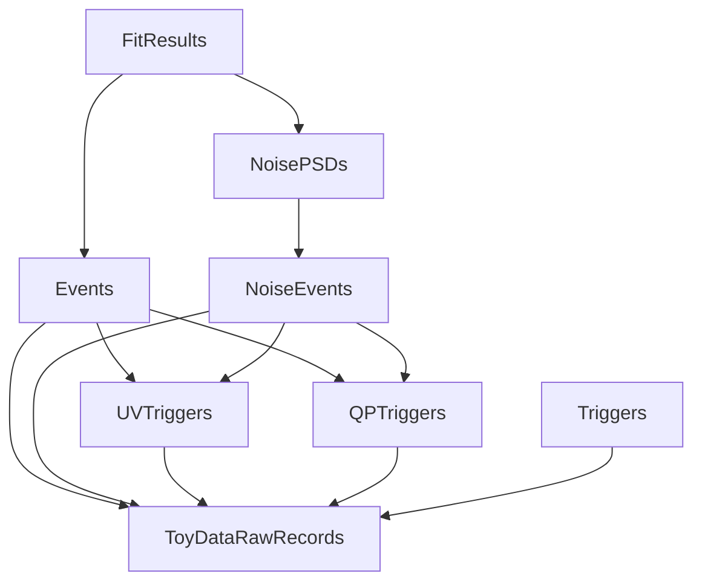

# Dependency tree of Helix plugins

### Links to plugins' documentation pages
- [FitResults](plugins/FitResults.md)
- [NoisePSDs](plugins/NoisePSDs.md)
- [Events](plugins/Events.md)
- [NoiseEvents](plugins/NoiseEvents.md)
- [UVTriggers](plugins/UVTriggers.md)
- [QPTriggers](plugins/QPTriggers.md)
- [Triggers](plugins/Triggers.md)
- [ToyDataRawRecords](plugins/ToyDataRawRecords.md)
