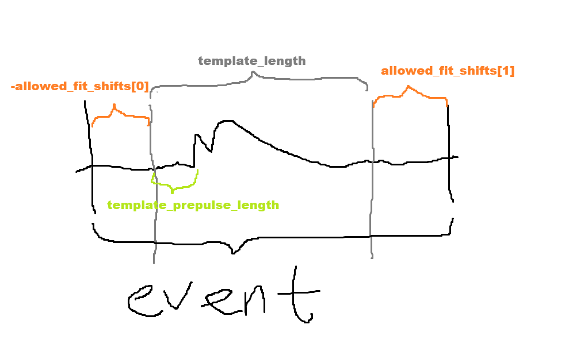

# Events plugin

### depends_on: `('raw_records', 'qp_triggers', 'uv_triggers')`
### provides: `events`
### data_kind: `events`

## Options
    
<table>
    <thead align=left>
        <tr><th>option</th><th>type</th><th>default</th><th>description</th></tr>
    </thead>
    <tr>
        <td><tt>template_length</tt></td><td>int</td><td>16384</td><td>OF template length in samples </td>
    </tr>
    <tr>
        <td><tt>template_prepulse_length</tt></td><td>int</td><td>2048</td><td>Number of samples before the pulse in the OF template </td>
    </tr>
    <tr>
        <td><tt>channel_map</tt></td><td>dict</td><td>{ChannelType.SUBMERGED: (1, 35), ChannelType.VACUUM: (36, 50)}</td><td>Dictionary mapping channel types (SUBMERGED, VACUUM) to the corresponding range of channel numbers </td>
    </tr>
    <tr>
        <td><tt>allowed_fit_shifts</tt></td><td>tuple</td><td>(-200, 800)</td><td>Tuple of allowed left and right time shifts in the OF fits. In samples. Left shifts are negative </td>
    </tr>
</table>

## Output dtype

<table>
    <thead align=left>
        <tr><th>field</th><th>type</th><th>shape</th><th>description</th></tr>
    </thead>
    <tr>
        <td><tt>time</tt></td><td>int64</td><td>-</td><td>Start time since unix epoch [ns]</td>
    </tr>
    <tr>
        <td><tt>length</tt></td><td>int64</td><td>-</td><td>Length of the interval in samples</td>
    </tr>
    <tr>
        <td><tt>dt</tt></td><td>int16</td><td>-</td><td>Width of one sample [ns]</td>
    </tr>
    <tr>
        <td><tt>block_id</tt></td><td>int32</td><td>-</td><td>Id of the block of records in the run</td>
    </tr>
    <tr>
        <td><tt>block_time</tt></td><td>int64</td><td>-</td><td>Start time of the block since unix epoch [ns]</td>
    </tr>
    <tr>
        <td><tt>event_id</tt></td><td>int16</td><td>-</td><td>Event number in the record block</td>
    </tr>
    <tr>
        <td><tt>start_loc</tt></td><td>int32</td><td>-</td><td>Sample index in the record where the trace starts</td>
    </tr>
    <tr>
        <td><tt>channel_data</tt></td><td>float64</td><td>(n_channels, event_length)</td><td>Trace data in individual channels</td>
    </tr>
    <tr>
        <td><tt>channels</tt></td><td>int16</td><td>(n_channels)</td><td>Channel numbers</td>
    </tr>
    <tr>
        <td><tt>data</tt></td><td>float64</td><td>(n_summed_channels, event_length)</td><td>Summed traces of summed_channel_types</td>
    </tr>
    <tr>
        <td><tt>summed_channel_types</tt></td><td>int16</td><td>(n_summed_channels)</td><td>Types of the summed traces</td>
    </tr>
    <tr>
        <td><tt>summed_channel_masks</tt></td><td>bool_</td><td>-</td><td>Mask of channels that were summed up to produce the summed traces</td>
    </tr>
</table>

`n_summed_channels = 6`, corresponding to the sum of submerged channels (with and without triggers), sum of vacuum channels, sum of all channels, sum of triggered submerged channels, sum of triggered vacuum channels and sum of all triggered channels

## Description

Event-building plugin. Groups QP and UV triggers in different channels into one event if they are within a
configurable time window from one another. Cuts out pieces of raw records around each such event for further
processing.

Currently, an event has the length of `template_length + allowed_fit_shifts[1] - allowed_fit_shifts[0]`. This behaviour
should change in the future. 
