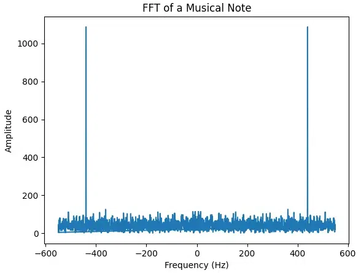

# Power Spectral Density (PSD) and Cross-Spectral Density (CSD)

## One- and two-sided PSD

A real-valued trace in frequency domain is symmetrical around the 0 frequency:



This allows to fold the FFTs in half to optimize calculations when working with real-valued traces. The functions
`psd_to_trace_length`, `trace_to_psd_length` and `unfold_psd` are tools for determining the length of a PSD array from
the length of a trace (and the other way around), as well as unfolding PSD (used in the OptimimFilter classes. Although,
we could optimize the OptimumFilter classes by using folded one-sided PSDs together with rfft and irfft functions).

## CSD indexing

To fully characterize noise in `N` channels, one could calculate the full matrix of cross-spectral densities, resulting
in `N**2` CSDs (with `N` of them being PSDs). However, each CSD in this matrix would be duplicated, as the CSD for channels
(1, 2) is the same as the CSD for channels (2, 1). We actually need `N` PSDs, and `N*(N - 1)/2` CSDs to fully characterize
noise in `N` channels.

To stay memory-efficient, instead of saving CSDs in a 3-dimensional array of shape `(N, N, M)`, we want to save our CSDs
in a 2-dimensional array of shape `(N*(N - 1)/2, M)` (where `M` is the CSD length, calculated as
`M = helix.trace_to_psd_length(L)`, where `L` is the length of noise traces).

However, this makes it difficult to locate the required CSD. Which CSD index do I need if I want a CSD for channels (5, 10)?
The `get_csd_index` function answers that question for you.

To calculate the PSD of the sum of a set of channels, you need the PSDs of each channel as well as the CSDs of all their
possible pair combinations. `get_all_growing_pairs` provides a list of all the unique channel pairs. The output of this
function can be passed to the `get_csd_index` function to get the indices of all the CSDs required to calculate the PSD
of the sum.

## Reference

```python
def psd_to_trace_length(psd_length, trace_length_is_even=True):
    """
    Returns the trace length corresponding to the provided length of the folded PSD
    :param psd_length: length of the folded PSD array
    :param trace_length_is_even: whether the trace length is even.
    :return: trace length corresponding to the PSD
    """

def trace_to_psd_length(trace_length):
    """
    Returns the length of the folded PSD for the specified trace length
    :param trace_length: trace length in time samples
    :return: lenght of folded PSD
    """

def unfold_psd(psd, trace_length_is_even=True):
    """
    Unfolds folded PSD. (PSDs for real-valued traces are symmetrical, therefore they can be folded in half.)
    :param psd: folded PSD. Can be multidimensional
    :param trace_length_is_even: whether the trace length is even. This defines whether folded PSD has an unpaired
    frequency component corresponding to the maximal frequency
    :return: unfodled PSD
    """

def calculate_csd(traces_a, traces_b, sampling_frequency=1.0):
    """
    Calculates the real part of the Cross-Spectral Densities of two sets of traces.
    Adapted from https://github.com/spice-herald/QETpy/blob/master/qetpy/core/_noise.py

    :param traces_a: first set of traces. n-dimensional: (n1, n2, ..., nm, n_traces_per_CSD, trace_length)
    :param traces_b: second set of traces. n-dimensional: (n1, n2, ..., nm, n_traces_per_CSD, trace_length)
    :param sampling_frequency: sampling frequency in Hz
    :return: (f, csd) - frequency components and folded real parts of the CSDs of shape (n1, ..., nm, trace_length//2+1)
    """

def calculate_psd(traces, sampling_frequency=1.0):
    """
    Calculates the Power Spectral Densities of traces.

    :param traces: array of traces. n-dimensional: (n1, n2, ..., nm, n_traces_per_PSD, trace_length)
    :param sampling_frequency: sampling frequency in Hz
    :return: (f, psd) - frequency components and folded PSDs of shape (n1, ..., nm, trace_length//2+1)
    """

def get_csd_index(n_channels, channel_indices):
    """
    Takes a pair of channel indices and returns a CSD index corresponding to the CSD of this pair.
    For a set of channels, the number of all the possible CSDs is not n_channels^2, but n_channels*(n_channels - 1)/2.
    Therefore, to save memory, it is convinient to save CSDs in a 2d-array (n_csds, csd_length) rather than in a
    3d-array (n_channels, n_channels, csd_length).

    :param n_channels: number of channels in the channel map
    :param channel_indices: a 2d array of pairs of channel indices. Or a 1d-array with one pair.
    :return: an array of CSD indices or one CSD index if channel_indices is 1d
    """

def get_all_growing_pairs(x):
    """
    Returns all the possible (A, B) pairs of elements such that A < B
    :param x: list of elements
    :return: array of all the possible growing pairs
    """

def calculate_psd_of_sum(psds, csds, channel_mask):
    """
    Calculates a PSD of the sum of channels form individual channel PSDs and their CSDs
    :param psds: channel PSDs
    :param csds: CSDs of all the unique channel pairs sorted with by the get_csd_index function
    :param channel_mask: mask of channels to sum
    :return: PSD of the sum of channels
    """
```